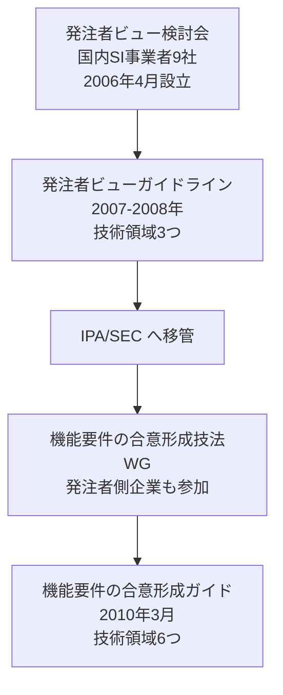

# agreement-forming — 発注者と開発者の合意形成

IPA が策定した、外部設計工程における合意形成のコツを集めたガイドの系譜。

## 系譜



## 構成

| 範囲 | 内容 |
| --- | --- |
| [ipa-guide-2010/](ipa-guide-2010/) | 機能要件の合意形成ガイド（2010年3月）。概要編＋6技術領域 |
| [client-view-2007/](client-view-2007/) | 発注者ビューガイドライン（2007〜2008年）。前身。技術領域3つ |
| [合意成熟度の3レベル](maturity-levels.md) | 両版にまたがる概念 |
| [4つの作業の区分](four-activities.md) | 両版にまたがる概念 |

**版でディレクトリを分けている。** 両者に同名の編（画面編、システム振舞い編、
データモデル編）があるため、パスで版と編の両方が読めるようにした。

## 対象工程

**外部設計工程である。要件定義ではない。**

## 使用条件（継承元）

機能要件の合意形成ガイドについて。

```yaml
rights:
  holder: 独立行政法人情報処理推進機構（IPA）
  redistribution: permitted
  derivation: prohibited
  attribution: 機能要件の合意形成ガイド ver.1.0、Copyright©2010 IPA
  conditions: 著作権表示を明記し、情報システム開発に携わる者が本目的のために行う場合に限る
  policy: 本リポジトリでは本文を転記も言い換えもしない
  verified: 2026-09-18
```

**複製・再配布は許されている。禁じられているのは改変・翻案である。**
本リポジトリが転記も言い換えもしないのは、翻案の禁止を確実に守るための
**運用上の方針**であって、権利の制約そのものではない。両者を分けて記録する。

参照するのは著作物にあたらない事実（技術領域の区分、成熟度のレベル名、
作業の区分、工程成果物の名称）に限る。

## 想定するプロジェクト規模

300ファンクションポイント以上、5000万円以上、10名以上、50人月以上を目安とする。
個人プロジェクトはこの想定から外れる。

ただしガイド自身が、開発規模が小さくメンバも少ないプロジェクトでも合意は必要であり、
書き方とレビューのコツを参考にしてほしいと述べている。したがって
`applicable_to_solo: partial` とし、**読み替えの内容を各エントリの `notes` に書く。**

発注者と開発者が別であることを前提とする。個人開発では両者が同一人物になる。
