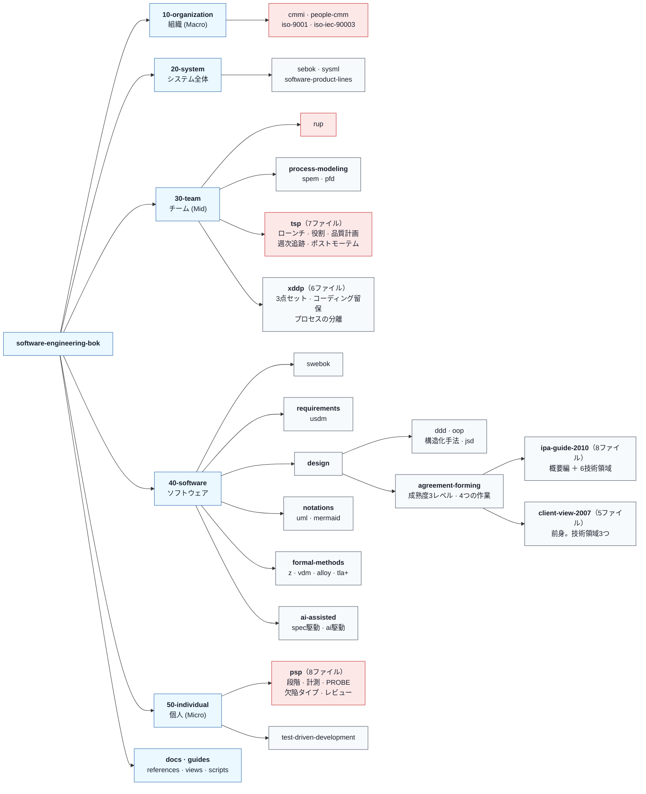

# software-engineering-bok

ソフトウェア工学の手法を、**一次情報の参照集**として集めるリポジトリ。

BoK は Body of Knowledge（知識体系）の略である。名前は
[SWEBOK Guide](https://www.computer.org/education/bodies-of-knowledge/software-engineering)
と同じ語彙を採っているが、**IEEE Computer Society の SWEBOK Guide とは無関係**の
個人リポジトリである。

---

## 構成



<span style="color:#c53030">■</span> 赤は**権利上の制約が強く、`status: referenced-only` で扱うもの**。
CMMI・People CMM・ISO 規格・RUP・PSP・TSP が該当する。IPA の各ガイドは複製が許されるが翻案は禁じられている。

<details><summary>Mermaid のソースを見る</summary>

````

````

</details>

<details><summary>全ファイルを展開して見る</summary>

```text
software-engineering-bok/
├── README.md
├── LICENSE
│
├── 10-organization/                              # 組織が採る枠組み (Macro)
│   ├── README.md
│   ├── cmmi.md                                   # ISACA。商標は CMU。V3.0（2023）
│   ├── people-cmm.md                             # CMU/SEI
│   ├── iso-9001.md                               # 品質マネジメントシステムの要求事項
│   └── iso-iec-90003.md                          # ISO 9001 のソフトウェアへの適用指針
│
├── 20-system/                                    # システム全体を対象とするもの
│   ├── README.md                                 # ソフトウェア工学との境界を書く
│   ├── sebok.md                                  # 別分野の知識体系。リンクと境界のみ
│   ├── sysml.md                                  # OMG。UML プロファイル
│   └── software-product-lines.md                 # SEI
│
├── 30-team/                                      # チームの進め方 (Mid)
│   ├── README.md
│   ├── rup.md                                    # IBM proprietary。事実上レガシー
│   ├── process-modeling/
│   │   ├── README.md
│   │   ├── spem.md                               # OMG。SPEM 2.0（2008）
│   │   └── pfd.md                                # 清水吉男 / AFFORDD
│   ├── tsp/                                      # SEI。rights の継承元
│   │   ├── README.md                             # PSP を前提とすること、コーチの必要性
│   │   ├── launch.md                             # ローンチ
│   │   ├── relaunch.md                           # リローンチ
│   │   ├── team-roles.md                         # チームリーダーと役割マネージャ
│   │   ├── quality-plan.md                       # 欠陥の作り込みと除去を数値で計画する
│   │   ├── weekly-tracking.md                    # 週次報告とアーンドバリュー
│   │   └── postmortem.md                         # サイクル終了時の分析
│   └── xddp/                                     # 清水吉男 / AFFORDD。rights の継承元
│       ├── README.md
│       ├── change-request-spec.md                # 変更要求仕様書（USDM 形式）— ①
│       ├── spec-out-and-tm.md                    # スペックアウトと TM — ②
│       ├── change-design-doc.md                  # 変更設計書 — ③
│       ├── coding-restraint.md                   # コーディング留保
│       └── process-separation.md                 # 変更プロセスと機能追加プロセスの分離
│
├── 40-software/                                  # ソフトウェアそのものを対象とするもの
│   ├── README.md
│   ├── swebok.md                                 # IEEE CS。名前の由来。無関係である旨を書く
│   ├── requirements/
│   │   ├── README.md
│   │   └── usdm.md                               # 清水吉男 / AFFORDD
│   ├── design/
│   │   ├── README.md                             # 二次情報にある2つの誤りを名指しで書く
│   │   ├── agreement-forming/                    # IPA。rights の継承元
│   │   │   ├── README.md                         # 系譜、対象工程、使用条件、想定規模
│   │   │   ├── maturity-levels.md                # 合意成熟度の3レベル（仕掛・充実・完成）
│   │   │   ├── four-activities.md                # 4つの作業の区分
│   │   │   ├── ipa-guide-2010/                   # 機能要件の合意形成ガイド（全7編）
│   │   │   │   ├── README.md                     # 概要編は技術領域ではない
│   │   │   │   ├── overview.md                   # 概要編
│   │   │   │   ├── system-behavior.md            # システム振舞い編
│   │   │   │   ├── screen.md                     # 画面編
│   │   │   │   ├── data-model.md                 # データモデル編
│   │   │   │   ├── external-interface.md         # 外部インタフェース編
│   │   │   │   ├── batch.md                      # バッチ編
│   │   │   │   └── report.md                     # 帳票編
│   │   │   └── client-view-2007/                 # 発注者ビューガイドライン（前身）
│   │   │       ├── README.md                     # 現行でない。WARP でのみ確認できる
│   │   │       ├── screen.md                     # 画面編（2007年9月）
│   │   │       ├── system-behavior.md            # システム振舞い編（2008年3月）
│   │   │       ├── data-model.md                 # データモデル編（2008年3月）
│   │   │       └── overview-glossary.md          # 概説編・用語集（2008年）
│   │   ├── domain-driven-design.md               # Evans
│   │   ├── object-oriented-design.md
│   │   ├── structured-analysis-design.md         # DeMarco / Yourdon 系
│   │   └── jackson-system-development.md         # JSD。上とは別系統
│   ├── notations/
│   │   ├── README.md
│   │   ├── uml.md                                # OMG
│   │   └── mermaid.md
│   ├── formal-methods/
│   │   ├── README.md                             # USDM・PFD・SPEM が形式手法でない理由
│   │   ├── z-notation.md                         # ISO/IEC 13568:2002。ITTF から無償
│   │   ├── vdm.md                                # ISO/IEC 13817-1:1996
│   │   ├── alloy.md                              # MIT。有界探索。証明ではない
│   │   └── tla-plus.md                           # Lamport。TLC と TLAPS
│   └── ai-assisted/
│       ├── README.md                             # 確認日を必ず書く
│       ├── spec-driven-development.md            # GitHub Spec Kit ほか。2025年以降
│       └── ai-driven-development.md              # 市場用語。定義が定まっていない
│
├── 50-individual/                                # 個人の規律 (Micro)
│   ├── README.md
│   ├── psp/                                      # SEI。rights の継承元
│   │   ├── README.md                             # 段階、TSP の前提であること、権利
│   │   ├── process-levels.md                     # PSP の段階
│   │   ├── measurement-logs.md                   # 時間・欠陥・サイズの記録
│   │   ├── defect-type-standard.md               # 欠陥タイプ標準
│   │   ├── probe-estimation.md                   # PROBE による見積り
│   │   ├── planning-and-tracking.md              # 計画と追跡
│   │   ├── design-and-code-reviews.md            # 個人レビュー
│   │   └── postmortem.md                         # ポストモーテム
│   └── test-driven-development.md                # XP 由来
│
├── docs/
│   ├── adr/
│   │   ├── adr-0001-repository-naming.md         # accepted
│   │   ├── adr-0002-scope.md                     # draft。決定欄が空
│   │   └── adr-0003-license.md                   # draft。決定欄が空
│   ├── conventions/                              # 現在の正
│   │   ├── README.md
│   │   ├── entry-format.md                       # 手法エントリとグループ README の2種
│   │   ├── layers.md                             # 階層の定義とディレクトリにする条件
│   │   └── selection-axes.md                     # 選択の軸。プロジェクトが選ぶ側
│   └── reviews/
│       ├── README.md                             # 索引。上書きされた箇所を明示
│       ├── rev-0001-methodology-selection-guide.md
│       ├── rev-0002-process-standards-and-boks.md
│       ├── rev-0003-directory-structure.md
│       ├── rev-0004-layered-tree-reconciled.md
│       ├── rev-0005-xddp-placement.md
│       ├── rev-0006-pfd-placement.md
│       ├── rev-0007-spem-placement.md
│       ├── rev-0008-formal-methods.md
│       ├── rev-0009-cross-repository-audit.md
│       └── rev-0010-ipa-guidelines.md
│
├── guides/
│   └── selection/
│       ├── README.md                             # 軸ごとに選ぶ手順
│       └── combinations.md                       # 依存と、両立しない組み合わせ
├── references/
│   └── README.md                                 # 参考文献。書籍の書誌と一次資料の URL
├── views/                                        # 生成物。手で編集しない
│   ├── by-kind.md
│   ├── by-formality.md
│   ├── by-rights.md                              # 継承を展開して出す
│   └── by-status.md
└── scripts/
    └── generate-views.mjs                        # Front Matter から views/ を生成する
```

</details>

各手法の一次資料と書籍は、**[参考文献の一覧](references/README.md)** にまとめてある。

---

## このリポジトリが書くもの・書かないもの

各手法の解説は**書かない**。置くのは次の3つだけである。

1. 一次資料の所在（URL、書誌）
2. 独自に構成した判断軸（どの軸で、何を、なぜ選ぶか）
3. 使用条件（権利者と制約）

**本文の転記も言い換えもしない。** これは運用上の方針であり、権利の制約そのものとは
区別して記録する。扱う対象のうち、たとえば IPA の機能要件の合意形成ガイドは
著作権表示を明記すれば複製・再配布できるが、改変・翻案は禁じられている。
ISO 9001 のように複製自体ができないものもある。**制約の中身は対象ごとに違う。**

各エントリの `rights` 欄に権利者と制約を書く。**書けない項目は登録しない。**
同じ条件を共有する群は、グループの `README.md` から `rights: inherit` で継承できるが、
**欄の省略は認めない。** `sources` は継承せず、各エントリが自分の一次資料と確認日を持つ。

---

## 現在の状態

**56件の手法エントリが雛形として登録されている。** 本文は書かれていない。
各エントリが持つのは Front Matter と一次資料へのリンクだけである。

| 内容 | 件数 |
| --- | --- |
| 手法エントリ | 56 |
| グループ README（`rights` の継承元） | 6 |
| 階層の README | 11 |
| 決定記録（ADR） | 3（うち確定は1） |
| 検証記録（REV） | 10 ＋ 索引 |
| 運用文書（`docs/conventions/`） | 4 |
| 参考文献 | 1 |
| 一覧（`views/`。生成物） | 4 |
| 選択ガイド | 2 |
| スクリプト | 1 |

### 権利の確認が最大のボトルネック

| `rights.verified` | 件数 |
| --- | --- |
| 日付が入っている | **13** |
| 未確認 | **43** |

**`referenced-only` が既定である。** `registered` に上げるのは、
`rights.verified` に日付が入ってからとする。現状の内訳は
[`views/by-status.md`](views/by-status.md) と
[`views/by-rights.md`](views/by-rights.md) にある。

**公開の前には `views/by-rights.md` を見る。** 56件の権利が1枚の表になっている。

### 決まっていないこと

| # | 未決事項 | 影響 |
| --- | --- | --- |
| 1 | 上流工程（要件定義・設計）を含むか | 含まない場合、`requirements/`、`design/`、`formal-methods/` がまとめて対象外になる |
| 2 | ソフトウェア工学以外（システムズエンジニアリング、組織品質マネジメント）を含むか | 含まない場合、`10-organization/` と `20-system/` の大半が対象外になる |
| 3 | ライセンス | MIT は文書リポジトリに適さない |

1と2は [ADR-0002](docs/adr/adr-0002-scope.md)、3は
[ADR-0003](docs/adr/adr-0003-license.md) で決める。**いずれも草案であり、決定欄が空である。**

**ADR-0002 の結果次第で、登録済みのエントリのうち最大40件が対象外になる。**
決めてから作るのではなく、作ってから削る順序を採った。実物を見て判断するためである。

---

## 並べている軸

ディレクトリの階層は**「適用範囲と対象」の1軸**で並べている。
**この階層は唯一の分類ではない。** 表せない軸は各ファイルの Front Matter に持たせ、
`views/` に一覧を生成する。

| 軸 | 選択肢の例 |
| --- | --- |
| パラダイム | 構造化 / オブジェクト指向 / 関数型 |
| 設計アプローチ | DDD / トランザクションスクリプト |
| プロセス | RUP / TSP / XDDP / V字 |
| 記法 | UML / SysML / PFD / Mermaid |
| 再利用戦略 | SPLE / 都度開発 |
| 実装プラクティス | PSP / TDD / Spec 駆動 |
| 適用範囲 | 組織 / チーム / 個人 |
| 開発の起点 | 新規（greenfield）/ 派生（derivative）/ 両方 |

軸のあいだには依存がある。DDD はオブジェクト指向を前提とし、XDDP は母体が
無いと適用できず、TSP は PSP を修めた技術者を前提とする。
**軸を独立に選べるわけではない。** 制約は
[`guides/selection/combinations.md`](guides/selection/combinations.md) にある。

加えて、形式性（`informal` / `semi-formal` / `formal`）と検証方法を欄として持つ。
USDM、UML、PFD、SPEM は `semi-formal` であり、**形式手法ではない。**
Z、VDM、Alloy、TLA+ が `formal` である。

軸の定義は [`docs/conventions/selection-axes.md`](docs/conventions/selection-axes.md)、
Front Matter の仕様は [`docs/conventions/entry-format.md`](docs/conventions/entry-format.md) にある。

---

## 文書

### 現在の決定

**[`docs/conventions/`](docs/conventions/) がここでは正である。**
検証記録は経緯であり、後の検証で上書きされた箇所がある。

| 文書 | 扱う範囲 |
| --- | --- |
| [entry-format.md](docs/conventions/entry-format.md) | Front Matter の仕様 |
| [layers.md](docs/conventions/layers.md) | 階層の定義と、ディレクトリにする条件 |
| [selection-axes.md](docs/conventions/selection-axes.md) | 選択の軸 |

### 決定記録

| ID | 内容 | 状態 |
| --- | --- | --- |
| [ADR-0001](docs/adr/adr-0001-repository-naming.md) | リポジトリ名の選定 | accepted |
| [ADR-0002](docs/adr/adr-0002-scope.md) | スコープ | **draft** |
| [ADR-0003](docs/adr/adr-0003-license.md) | ライセンス | **draft** |

### 検証記録

索引と、上書きされた決定の一覧は
[`docs/reviews/README.md`](docs/reviews/README.md) にある。**REV を読む前にそこを見ること。**

| ID | 内容 |
| --- | --- |
| [REV-0001](docs/reviews/rev-0001-methodology-selection-guide.md) | メソドロジー選択ガイド。6軸の定義 |
| [REV-0002](docs/reviews/rev-0002-process-standards-and-boks.md) | プロセス標準と知識体系。権利制約と第7軸 |
| [REV-0003](docs/reviews/rev-0003-directory-structure.md) | ディレクトリ構成の初案 |
| [REV-0004](docs/reviews/rev-0004-layered-tree-reconciled.md) | 階層ツリーと軸の両立 |
| [REV-0005](docs/reviews/rev-0005-xddp-placement.md) | XDDP の配置。3点セットと第8軸 |
| [REV-0006](docs/reviews/rev-0006-pfd-placement.md) | PFD の配置。記法とプロセスの区別 |
| [REV-0007](docs/reviews/rev-0007-spem-placement.md) | SPEM の配置。RUP との前後関係 |
| [REV-0008](docs/reviews/rev-0008-formal-methods.md) | 形式手法。`formality` 欄の追加 |
| [REV-0009](docs/reviews/rev-0009-cross-repository-audit.md) | リポジトリ横断監査（**訂正あり**） |
| [REV-0010](docs/reviews/rev-0010-ipa-guidelines.md) | IPA ガイドライン。`rights` 欄の分解 |

### 参考文献

| 一覧 | 内容 |
| --- | --- |
| [references/README.md](references/README.md) | 各手法の一次資料。書籍の書誌と URL。**確認の状態を併記** |

---

## 一覧を生成する

`views/` は生成物である。**手で編集しない。**

```
node scripts/generate-views.mjs
```

Front Matter から4つの一覧を作る。`rights` の継承は展開し、継承元も併記する。

**`verify: manual` の `sources` は到達確認を行わない。**
IPA・AFFORDD・WARP・Mermaid の各サイトは自動取得を制限しているため、
自動で通ったように見せてはいけない。

---

## 姉妹リポジトリ

要件定義と設計の一次情報（USDM、XDDP、IPA の各ガイドライン）は、
[`paper-repro`](https://github.com/ChestnutForest/paper-repro) の
[`docs/references-usdm-ipa.md`](https://github.com/ChestnutForest/paper-repro/blob/main/docs/references-usdm-ipa.md)
にある。本リポジトリへ移設するか、相互参照にとどめるかは未定である。

ソフトウェアプロセス（PSP / TSP）の実装は
[`processloop`](https://github.com/ChestnutForest/processloop) にある。

> **旧名について** — `paper-repro` は2026年9月7日まで `paper-repro-mvp` という
> 名前だった。本リポジトリの文書に現れる `paper-repro-mvp` は旧名への言及であり、
> 別のリポジトリを指すものではない。経緯は
> [REV-0009 第2章](docs/reviews/rev-0009-cross-repository-audit.md)にある。

---

## ライセンス

現在は MIT だが、**文書リポジトリには適さないため見直す予定である**
（[ADR-0003](docs/adr/adr-0003-license.md)）。
それまで、本リポジトリの内容の再利用にあたっては、
各エントリの `rights` 欄に記した一次資料の使用条件を優先して確認すること。

**本リポジトリのライセンスは、収録した一次資料の条件を上書きしない。**
