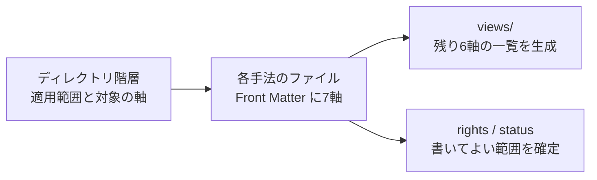

# REV-0004 階層ツリー構成と7軸の両立

## 1. 本書の位置づけ

REV-0003 は、5階層のディレクトリ構成を退け、`methods/` を平坦にする案を示した。
これに対し「階層ツリーのほうが理解しやすい」という指摘を受けた。

**この指摘は妥当である。** REV-0003 は表現の正確さを優先し、**見て分かること
（browsability）を評価軸に入れていなかった。** 一人で維持する知識リポジトリでは、
リポジトリを開いたときに全体像が掴めることは機能の1つであり、後回しにしてよい
性質ではない。

本書は REV-0003 第7章の代替案を置き換える。階層ツリーを採用したうえで、
REV-0001 から REV-0003 までに指摘した欠陥を個別に潰す。

## 2. REV-0003 の指摘のうち、残るものと取り下げるもの

| REV-0003 の指摘 | 判定 |
| --- | --- |
| 7軸を1本の階層に潰している | **取り下げる。** 木は1軸で構わない。ただし「どの軸で並べているか」を明示し、残り6軸を別途たどれるようにする |
| `docs/` を無視している | **残る** |
| 権利情報の置き場がない | **残る** |
| 未確定のスコープを先取りしている | **残る** |
| 分類の誤りが7件、UML の置き場が無い | **残る** |
| 出典を確認できない記述がある | **残る** |
| 連番と表記 | **残る（一部修正）** |

つまり問題は**木構造そのものではなく、木が1軸だけを暗黙に特権化していたこと**、
および**葉がディレクトリだったこと**であった。この2点を直せば、ご提示の
テイストはそのまま使える。

## 3. 直すべき2点

### 3.1 並べている軸を明示する

木が悪いのではなく、**どの軸で並べているかが書かれていない**ことが問題だった。
本リポジトリでは次のように宣言する。

> ディレクトリの階層は「適用範囲と対象」の軸で並べている。
> パラダイム、設計アプローチ、プロセス、記法、再利用戦略、実装プラクティスの
> 6軸は、各ファイルの Front Matter に持たせ、`views/` に一覧を生成する。

これを README と各階層の `README.md` に書く。書いてあれば、木は
「1つの入口」であって「唯一の分類」ではないことが読み手に伝わる。

### 3.2 葉をディレクトリではなくファイルにする

REV-0003 第3.3章で述べたとおり、`cmmi/` という空のディレクトリは、そこに
解説を書く運用を招く。ISO 規格の本文は再配布できず、CMMI のモデル本文は有償
ライセンスで、PSP と TSP は CMU の特別許諾下にある。

**葉を1ファイルにすれば、Front Matter の `rights` と `status` を必ず通ることになる。**
書いてよい範囲がファイルの冒頭で決まる。



## 4. 修正したリポジトリ構成

ご提示の構成のテイストを保ったまま、指摘を反映した。

```text
software-engineering-bok/
├── README.md                          # 目的、全体像の図、並べている軸の宣言
├── docs/                              # 決定と検証の記録（既存を維持）
│   ├── adr/
│   ├── reviews/
│   └── conventions/
│       ├── axes.md                    # 7軸の定義
│       ├── method-entry-format.md     # Front Matter の仕様
│       └── layer-definitions.md       # 各階層に何を置き、何を置かないか
│
├── guides/                            # 階層を横断するドキュメント
│   └── selection/
│       ├── README.md                  # 軸ごとに選ぶ手順
│       └── combinations.md            # 依存と、両立しない組み合わせ
│
├── 10-organization/                   # 組織・品質マネジメント層 (Macro)
│   ├── README.md                      # この階層の定義と境界
│   ├── cmmi.md                        # 参照のみ。ISACA。商標は CMU
│   ├── people-cmm.md                  # 参照のみ。CMMI V3.0 の People Management が後継
│   ├── iso-9001.md                    # 参照のみ。要求事項。認証制度
│   └── iso-iec-90003.md               # 参照のみ。ソフトウェアへの適用指針
│
├── 20-system/                         # システム全体を対象とする層
│   ├── README.md
│   ├── sebok.md                       # 参照のみ。別分野の知識体系。境界の記述だけ
│   ├── sysml.md                       # 記法。OMG
│   └── software-product-lines.md      # 再利用戦略。SEI
│
├── 30-team/                           # チーム開発プロセス層 (Mid)
│   ├── README.md
│   ├── rup.md                         # 参照のみ。IBM proprietary。事実上レガシー
│   ├── tsp.md                         # 参照のみ。CMU のサービスマーク
│   └── xddp.md                        # 派生開発プロセス。AFFORDD
│
├── 40-software/                       # ソフトウェアそのものを対象とする層
│   ├── README.md
│   ├── requirements/                  # ★着手点
│   │   ├── README.md
│   │   ├── usdm.md
│   │   └── ipa-agreement-guide.md
│   ├── design/
│   │   ├── README.md
│   │   ├── domain-driven-design.md
│   │   ├── object-oriented-design.md
│   │   ├── structured-analysis-design.md   # DeMarco / Yourdon 系
│   │   └── jackson-system-development.md   # JSD。上とは別系統
│   ├── notations/
│   │   ├── README.md
│   │   ├── uml.md
│   │   └── mermaid.md
│   ├── formal-methods/
│   │   ├── README.md                  # USDM との違いを明記する
│   │   ├── z-notation.md
│   │   ├── vdm.md
│   │   ├── tla-plus.md
│   │   └── alloy.md
│   └── ai-assisted/
│       ├── README.md
│       └── spec-driven-development.md
│
├── 50-individual/                     # 個人の品質・規律層 (Micro)
│   ├── README.md
│   ├── psp.md                         # 参照のみ。CMU のサービスマーク。特別許諾
│   └── test-driven-development.md
│
├── references/                        # 一次情報の URL と使用条件
│   └── references-usdm-ipa.md
│
├── views/                             # Front Matter から生成。手で編集しない
│   ├── by-kind.md
│   ├── by-rights.md                   # 権利制約の強い順。公開前の確認に使う
│   └── by-status.md
│
└── scripts/
    └── generate-views.mjs
```

## 5. ご提示の構成からの変更点と、その理由

| # | 変更 | 理由 |
| --- | --- | --- |
| 1 | `docs/` を追加 | ADR-0001、REV-0001〜0004 の置き場。構成案では失われていた |
| 2 | 葉をディレクトリからファイルへ | 空ディレクトリが解説を書く運用を招く。Front Matter を必ず通す |
| 3 | 連番を 01〜05 から 10〜50 へ | 階層を挿入しても番号を振り直さずに済む |
| 4 | `04-software-design-and-implementation` を `40-software` へ | **要件工学を設計・実装の下に置けない。** SWEBOK v4 では Software Requirements と Software Design は別の知識領域である。「ソフトウェアを対象とする層」なら要件も含められる |
| 5 | `02-system-architecture` を `20-system` へ | SEBoK は知識体系、SysML は記法、SPLE は再利用戦略で、いずれもアーキテクチャ層の手法ではない。「システム全体を対象とする層」とすれば3つとも収まる |
| 6 | `40-software/notations/` に **UML を追加** | 構成案では UML の置き場が無かった |
| 7 | `spec-driven` を `50-individual` から `40-software/ai-assisted/` へ | REV-0001 第4.3章、REV-0002 第5章で2度指摘済み。エージェントへ仕様を渡す進め方であり、個人の規律ではない |
| 8 | `structured-methods（JSD）` を2ファイルに分割 | JSD は DeMarco / Yourdon 系の構造化分析・設計とは別系統である |
| 9 | `iso9000/` を `iso-9001.md` と `iso-iec-90003.md` に分割 | ISO 9000 は用語と基本。要求事項は ISO 9001、ソフトウェアへの適用指針は ISO/IEC 90003 |
| 10 | `software-product-line` を複数形へ | SEI の表記は Software Product Lines |
| 11 | `object-oriented` を `object-oriented-design` へ | 形容詞だけで名詞が無かった |
| 12 | `ai-driven-development（AI Relay Development等）` から例示を削除 | **「AI Relay Development」は確立した手法名として裏づけが取れなかった** |
| 13 | `30-team/xddp.md` を追加 | 姉妹リポジトリで扱っている派生開発プロセス。構成案では抜けていた |
| 14 | `formal-methods/README.md` に USDM との違いを明記 | REV-0001 第4.1章。USDM を形式手法と取り違える誤りを繰り返さない |
| 15 | `views/` と `scripts/` を追加 | 残り6軸をたどれるようにする。`by-rights.md` は公開前の確認に使う |
| 16 | 各階層に `README.md` を必須化 | 何を置き、何を置かないかを書く。境界が書かれていない階層は必ず溢れる |

## 6. 各ファイルの Front Matter

葉のファイルは次の Front Matter を必ず持つ。

```yaml
id: MTH-0004
name: CMMI
name_ja: 能力成熟度モデル統合
layer: 10-organization          # 木の位置。ディレクトリと一致させる
kind: appraisal-framework
axes:                           # 木で表していない6軸
  paradigm: null
  design_approach: null
  process: null
  notation: null
  reuse: null
  practice: null
status: referenced-only
applicable_to_solo: false
rights:
  holder: ISACA（商標は Carnegie Mellon University）
  terms: モデル本文は有償ライセンス。転記と翻案をしない
  verified: 2026-09-17
sources:
  - https://cmmiinstitute.com/
```

`status` の値は3つとする。

| 値 | 意味 | 本文に書けるもの |
| --- | --- | --- |
| `registered` | 選択肢として扱う | 独自に構成した判断軸、一次資料へのリンク |
| `referenced-only` | 参照のみ | **リンクと、著作物にあたらない事実のみ。** SEBoK、CMMI、ISO 規格、RUP、PSP、TSP はここに入る |
| `out-of-scope` | 対象外 | 対象外と判断した理由 |

**`status: referenced-only` が既定である。** `registered` に上げるときは、
一次資料の使用条件を確認した日付を `rights.verified` に記す。

## 7. 本リポジトリへ反映する決定

| # | 決定 |
| --- | --- |
| 1 | **階層ツリーを採用する。** ご提示のテイストを維持する |
| 2 | **並べている軸を README と各階層の README に明示する。** 木は唯一の分類ではない |
| 3 | **葉はファイルとする。** ディレクトリを作るのは、さらに分ける必要が生じたときだけ |
| 4 | **`docs/` を維持する** |
| 5 | **連番は10刻みとする** |
| 6 | **Front Matter に `layer`、`kind`、`axes`、`status`、`rights` を必須で持たせる** |
| 7 | **`views/` は生成物とし、手で編集しない** |
| 8 | **ディレクトリの作成は ADR-0002 の後に行う** |

決定8は REV-0003 から変わっていない。未決事項1（上流工程を含むか）と
未決事項5（ソフトウェア工学以外を含むか）が未確定のまま木を作ると、
**`10-organization/` と `20-system/` の存在自体が決定の先取りになる。**

## 8. 着手の順序

1. ADR-0002 でスコープ（未決事項1と5）を決める
2. `docs/conventions/` に `axes.md`、`method-entry-format.md`、`layer-definitions.md` を書く
3. `references-usdm-ipa.md` を移設するか相互参照にとどめるかを決める（未決事項3）
4. `40-software/requirements/usdm.md` を**1件だけ**作り、Front Matter の形式を検証する
5. 問題がなければ `ipa-agreement-guide.md`、`30-team/xddp.md` と続ける
6. 3件たまった時点で `scripts/generate-views.mjs` を書き、`views/` を生成する

**階層ディレクトリは、そこに置く1件目ができたときに作る。** 空の階層を先に
並べると、埋めるために書かなくてよいものを書くことになる。

## 9. ADR-0001 の未決事項への影響

| # | 未決事項 | 本検証による変化 |
| --- | --- | --- |
| 1 | 上流工程を含むかどうか | 変化なし。着手の前提条件 |
| 2 | 複数工程にまたがる手法の置き場 | **扱いが決まった。** 木の位置は `layer` で1つに決め、残り6軸は Front Matter で表す |
| 3 | `references-usdm-ipa.md` の移設可否 | 変化なし。着手の前提条件 |
| 4 | 文書の粒度と命名規則 | **本書で確定案を示した。** ADR-0002 で追認すること |
| 5 | ソフトウェア工学以外を含むか | 変化なし。着手の前提条件。`20-system/` の可否がこれで決まる |
